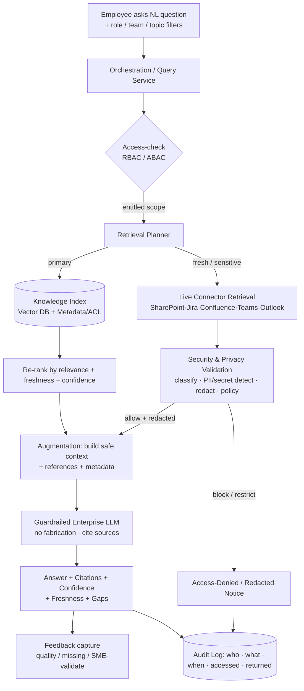

# Functional Architecture — Enterprise Knowledge Retention & Discovery Assistant

> **Project:** Mission CTRM · ION India Hackathon 2026 (CAT & Commodities Edition)
> **Problem Statement:** PS-019 — Enterprise Knowledge Retention & Discovery Assistant ("Organizational Brain")
> **Basis:** This functional architecture generalizes our current **privacy-aware
> Outlook chatbot pipeline** (see `5b404a7c-...png`) into a **multi-source
> enterprise knowledge assistant** as required by the problem statement.

---

## 1. Purpose & Guiding Principles

The system lets employees ask natural-language questions and receive **concise,
source-backed answers** drawn from approved enterprise knowledge sources, while
**respecting access control** and clearly showing provenance, confidence, and
gaps.

Carried forward from the current architecture as non-negotiable principles:

| Principle | Meaning |
|-----------|---------|
| **Privacy by design** | Raw source data never goes directly to the LLM. |
| **Security by default** | Deny by default, least privilege, ABAC/RBAC enforced before retrieval reaches generation. |
| **Safe context only** | Only authorized, filtered, redacted content is sent to the LLM. |
| **Provenance always** | Every answer carries citations, dates, owners, confidence, and gaps. |
| **Honest uncertainty** | The assistant says "I don't know" and flags SME validation instead of hallucinating. |

---

## 2. From Current System → Target System

The current diagram is **Outlook-only**. PS-019 requires **multi-source** knowledge
retrieval. The mapping below shows how each existing layer generalizes.

| Current (Outlook chatbot PNG) | Target (PS-019 assistant) |
|-------------------------------|---------------------------|
| User & Chatbot UI + SSO/AAD context | Same UI, plus role/team/product/topic filters |
| Outlook MCP / MS Graph retrieval | **Multi-connector layer** — SharePoint, Teams transcripts, Jira, Confluence (+ Outlook) |
| Security & Privacy validation layer | Same layer, source-agnostic; per-source ACL + classification |
| Option 1 live retrieval / Option 2 secure indexing | **Hybrid retrieval** — indexed corpus (primary) + live retrieval for fresh/sensitive items |
| Augmentation + guardrailed Enterprise LLM | Same; RAG over the unified knowledge index |
| Response with citations, redaction, audit | Same, plus **confidence, freshness, gaps, and feedback** capture |

---

## 3. Functional Building Blocks

```
 ┌──────────────────────────────────────────────────────────────────────────┐
 │ 1. EXPERIENCE LAYER                                                        │
 │    Chatbot UI · NL query box · role/team/product/topic filters · SSO      │
 └───────────────┬──────────────────────────────────────────────────────────┘
                 │  question + user context (role, team, entitlements)
 ┌───────────────▼──────────────────────────────────────────────────────────┐
 │ 2. ORCHESTRATION LAYER (Query Service)                                     │
 │    Intent parse · access-check · retrieval planning · re-ranking ·         │
 │    answer assembly · feedback routing                                      │
 └───────┬───────────────────────────────────────────────┬──────────────────┘
         │ retrieve                                        │ access-check
 ┌───────▼───────────────────────┐             ┌──────────▼──────────────────┐
 │ 3. CONNECTOR / SOURCE LAYER    │             │ 4. SECURITY & PRIVACY LAYER │
 │  SharePoint · Confluence ·     │────────────▶│  AuthN check · RBAC/ABAC ·  │
 │  Jira · Teams transcripts ·    │  raw items  │  classification · PII /      │
 │  Outlook (MCP / Graph)         │             │  secret detection · redaction│
 │  (mock or approved data)       │             │  · policy engine · audit log │
 └───────┬───────────────────────┘             └──────────┬──────────────────┘
         │ approved + redacted content                     │ allow / redact / block
 ┌───────▼─────────────────────────────────────────────────▼──────────────────┐
 │ 5. KNOWLEDGE INDEX LAYER                                                     │
 │    Chunking · embeddings (Vector DB) · metadata & ACL store ·               │
 │    freshness/owner registry · policy store                                  │
 └───────────────┬─────────────────────────────────────────────────────────────┘
                 │ relevant, access-filtered chunks
 ┌───────────────▼─────────────────────────────────────────────────────────────┐
 │ 6. AUGMENTATION + GENERATION LAYER                                           │
 │    Build safe context · add references/metadata · strip unauthorized ·      │
 │    guardrailed Enterprise LLM (no fabrication, cite sources)                │
 └───────────────┬─────────────────────────────────────────────────────────────┘
                 │ grounded answer
 ┌───────────────▼─────────────────────────────────────────────────────────────┐
 │ 7. RESPONSE & GOVERNANCE LAYER                                               │
 │    Answer + citations + confidence + freshness + gaps · redaction notice ·  │
 │    access-denied notice · audit trail · feedback capture                    │
 └─────────────────────────────────────────────────────────────────────────────┘
```

---

## 4. End-to-End Functional Flow



**Two retrieval modes (carried from the current Option 1 / Option 2 design):**

- **Indexed retrieval (primary):** approved, redacted, chunked knowledge stored
  in the vector + metadata store — fast reuse for FAQs, decisions, lessons
  learned, runbooks.
- **Live retrieval (on demand):** for fresh or sensitive items, fetch live,
  validate/redact per request, build a **temporary safe context**, and do **not**
  persist raw content by default.

---

## 5. Functional Modules

### 5.1 Experience Layer
- Natural-language query input and conversational responses.
- User context selection: role, team, product, topic filters.
- Displays answer, citations, confidence, freshness, gaps, and access notices.

### 5.2 Orchestration Layer (Query Service)
- Parses intent and required filters.
- Calls the access-check before any retrieval reaches generation.
- Plans hybrid retrieval (index vs. live), re-ranks, and assembles the answer.
- Routes user feedback to the feedback store.

### 5.3 Connector / Source Layer
- Source-specific connectors for **SharePoint, Confluence, Jira, Teams
  transcripts, Outlook (via MCP / MS Graph)**.
- For the 24h PoC: **20–50 mock or approved records across 2–3 source types**.
- Normalizes each item to a common record (text, owner, date, source, scope).

### 5.4 Security & Privacy Validation Layer *(reused from current architecture)*
- Authentication check; **RBAC / ABAC** entitlement evaluation.
- Data classification; **PII / secret / credential detection**.
- **Redaction engine** and **policy engine**.
- Security decision: **Allow (with redaction) · Restrict · Block**.
- Writes every decision to the **audit log**.

### 5.5 Knowledge Index Layer
- Chunking + embeddings in a **Vector DB**.
- **Metadata & ACL store** (owner, date, source, scope, permissions).
- **Freshness / owner registry** and **policy store** (rules & roles).
- Stores **only approved, redacted, reusable knowledge** — not raw source dumps.

### 5.6 Augmentation + Generation Layer
- Builds the **safe context**: allowed chunks + references + metadata; strips
  unauthorized content.
- **Guardrailed Enterprise LLM** (Private / Azure OpenAI / local): no
  fabrication, use only provided context, cite sources, never reveal restricted
  content.
- Produces answer, citations, summary, or an **access-denied** result.

### 5.7 Response & Governance Layer
- Answer with **source references, dates, owners, confidence, and gaps**.
- Redaction and access-denied notices where applicable.
- **Audit trail**: who asked, what, when, what was accessed, what was returned.
- **Feedback**: mark answer quality, missing sources, SME validation needed.

---

## 6. Functional Capabilities → API Mapping

Aligned to the suggested interfaces in PS-019:

| Capability | API | Owning module |
|------------|-----|---------------|
| Ask a grounded question | `POST /knowledge/query` | Orchestration |
| List available sources | `GET /knowledge/sources` | Connector layer |
| Index approved/mock records | `POST /knowledge/index` | Knowledge index |
| Retrieve answer details (refs, confidence, gaps) | `GET /knowledge/result/{id}` | Response layer |
| Capture feedback / SME-validation request | `POST /knowledge/feedback` | Governance |
| Check entitlement to a source/result | `GET /knowledge/access-check` | Security layer |

---

## 7. Access & Trust Model (Functional View)

1. **Deny by default / least privilege** — no source is readable unless the
   user's role/team/scope grants it.
2. **Pre-generation enforcement** — access-check and redaction happen **before**
   content reaches the LLM; restricted content is hidden or flagged, never sent.
3. **Visible governance** — answers show sources, confidence, freshness, and
   access assumptions; mocked roles/permissions remain visible in the PoC.
4. **Auditability** — every retrieval, decision, and response is logged.

---

## 8. Scope Alignment with PS-019

| Maturity level | Coverage in this architecture |
|----------------|-------------------------------|
| **L1** Single-source Q&A | Baseline via one connector + index + generation |
| **L2** Multi-source retrieval w/ references | Target — connector layer + unified index + provenance |
| **L3** Access-aware assistant | Security & privacy layer + freshness/confidence |
| **L4** Enterprise memory platform | Out of scope for 24h (future connectors/governance) |

**Definition of done:** a focused, demonstrable MVP proving **retrieval,
source-backed summarization, access-awareness, and reuse value** over a
constrained corpus — not a full enterprise platform.

---

## 9. PoC Build Outline (24h)

1. Pick a focused domain (e.g., onboarding, incident learnings, or product
   troubleshooting).
2. Create 20–50 mock/approved records across 2–3 source types.
3. Index them (chunk + embed + metadata/ACL).
4. Build the UI: NL question + role/team selection.
5. Retrieve most-relevant records, re-rank, build safe context.
6. Generate a concise answer with **references, confidence, assumptions, gaps**.
7. Demonstrate **role-based filtering** (restricted sources hidden/flagged).
8. Capture feedback + audit; explain how it scales to more repositories and
   governance controls post-hackathon.
